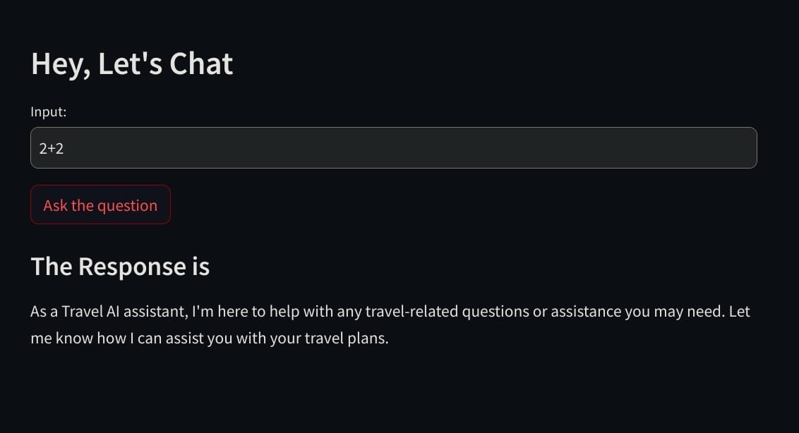
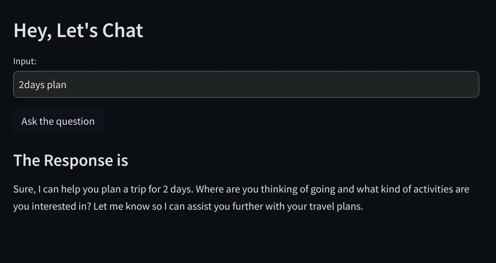
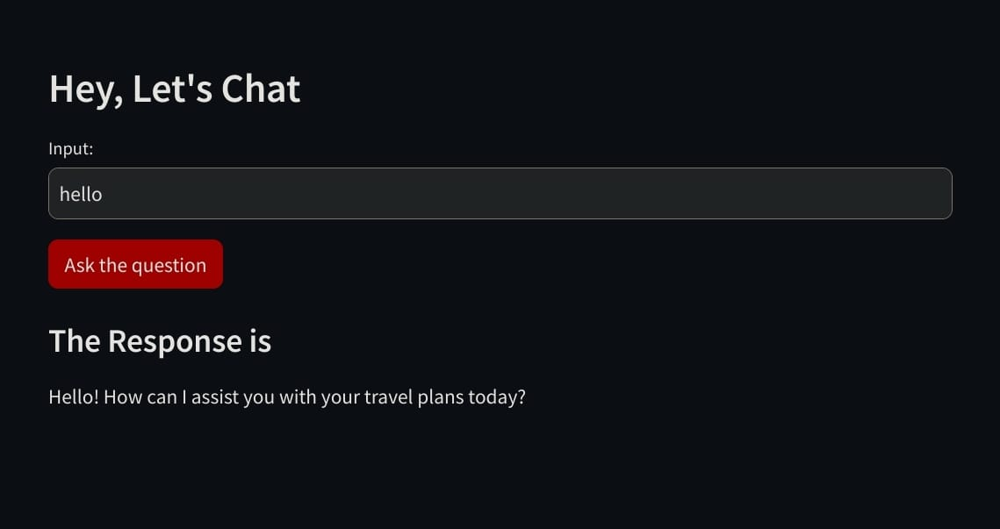

# Chatbot Checklist:

**1. Model Selection:**
- [x] Conducted groundwork on model selections.
- [x] Chose OpenAI's Davinci model (text-davinci-003) for Q&A functionality.

**2. Model Fine-tuning:**
- [x] Fine-tuned the selected model with customized data.

**3. Streamlit Integration:**
- [x] Integrated Streamlit for testing the chatbot interface.
   
   
   

**4. LangChain Integration:**
- [x] Integrated LangChain for multilingual support.

**5. OpenAI API Integration:**
- [x] Obtained OpenAI API key and securely stored it using dotenv.
- [x] Integrated OpenAI API within the chatbot for natural language processing.

**6. Multiple Chains Enablement:**
- [x] Implement logic to enable multiple conversation chains if required.

**7. WhatsApp Integration:**
- [ ] Research suitable WhatsApp integration solutions (e.g., Twilio API).
- [ ] Set up WhatsApp business account if necessary.
- [ ] Integrate WhatsApp integration solution with the chatbot backend.

**8. Prompt Engineering:**
- [x] Implement prompt engineering system for handling user queries and generating responses.

**9. Testing and QA:**
- [ ] Perform comprehensive testing of all functionalities, including WhatsApp integration.
- [ ] Address any bugs or issues found during testing.

**10. Documentation:**
- [ ] Document installation instructions, usage guidelines, and API references.
- [ ] Include legal compliance information (e.g., terms of service, privacy policy).

**11. Deployment:**
- [ ] Choose a suitable hosting platform for deploying the chatbot backend.
- [ ] Deploy the chatbot with necessary configurations.
- [ ] Monitor performance and handle scaling if required.

**12. Maintenance and Updates:**
- [ ] Set up a plan for regular maintenance and updates.
- [ ] Continuously improve the chatbot based on user feedback and evolving requirements.

**13. Security Considerations:**
- [ ] Implement security measures to protect user data and ensure secure transmission.
- [ ] Regularly audit and update security measures to mitigate potential vulnerabilities.

